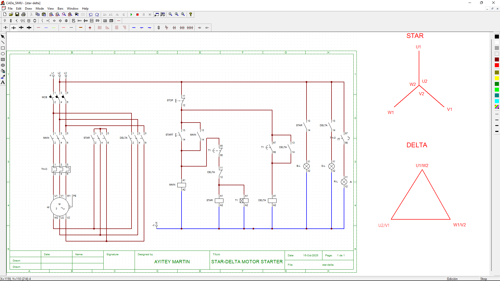

⭐ Star-Delta Motor Starter Project

🔧 Overview

This project demonstrates the design and simulation of a Star-Delta Motor Starter, a widely used method for reducing the starting current of three-phase induction motors. It’s ideal for motors rated above 5 HP and integrates both electrical wiring and control logic.

⚡ Why Star-Delta Starters Matter

The Star-Delta Motor Starter is essential for industrial motor control due to its ability to:

Reduce Starting Current: Limits inrush current to about one-third of direct-on-line (DOL) starting, minimizing voltage dips and protecting other equipment.

Protect Motor Windings: Starts in star configuration to reduce electrical and mechanical stress.

Cost-Effective: More affordable than soft starters or VFDs for motors that don’t require frequent starts/stops.

Widely Adopted: Common in manufacturing, water pumping, HVAC, and other industrial applications.

🎯 Objectives

Implement a reduced-voltage starter for a 3-phase motor

Simulate the control logic using CADe_SIMU

Demonstrate smooth transition from star to delta mode

Document the process for educational and portfolio purposes

🧰 Components Used

3-phase induction motor (simulated)

3 contactors: Main, Star, Delta

Timer relay

Overload relay

Push buttons: Start, Stop

Indicator lamps

Control circuit wiring (schematic)

⚙️ How It Works

Pressing the Start Button energizes the main and star contactors.

The Timer Relay counts down (e.g., 5–10 seconds).

After the delay, the star contactor deactivates and the delta contactor energizes.

The motor continues running in delta mode until stopped.

📷 Simulation Screenshot

▶️ Watch Simulation Video

▶️ [Watch Simulation Video](https://drive.google.com/file/d/1_rXf5xz2FHWXCqby2e-nmJG2SQCEl1tB/view?usp=sharing)

🧠 What I Learned

Practical application of contactor logic and timer relays

Safety considerations in motor control circuits

Troubleshooting transitions between star and delta modes

Visual documentation and simulation using CADe_SIMU
